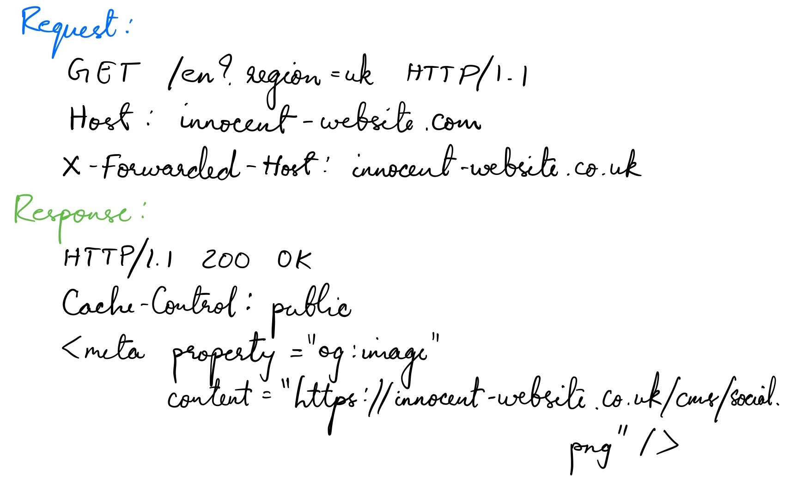

# Web cache poisoning
> Web cache poisoning is an advanced technique whereby an attacker exploits the behavior of a web server and cache so that a harmful HTTP response is served to other users.

## How does a web cache work?

### Cache keys
* Caches identify equivalent requests by comparing a predefined subset of the request's components, known collectively as the "cache key".

## What is the impact of a web cache poisoning attack?
* The impact of web cache poisoning is heavily dependent on two key factors:
    - What exactly the attacker can successfully get cached
    - The amount of traffic on the affected page

## Constructing a web cache poisoning attack
1. Identify and evaluate unkeyed inputs
2. Elicit a harmful response from the back-end server
3. Get the response cached

## Exploiting web cache poisoning vulnerabilities
### Cache design flaws
1. Using web cache poisoning to deliver an XSS attack 
    - The simplest web cache poisoning vulnerability to exploit is when unkeyed input is reflected in a cacheable response without proper sanitization.
    - Normal request and response:
    
    Poisoned request and response:
    

### Cache implementation flaws

## How to prevent web cache poisoning vulnerabilities
* The definitive way to prevent web cache poisoning would clearly be to disable caching altogether.
* If you do need to use caching, restricting it to purely static responses is also effective, provided you are sufficiently wary about what you class as "static".
* If you are considering excluding something from the cache key for performance reasons, rewrite the request instead.
* Don't accept fat GET requests. Be aware that some third-party technologies may permit this by default.
* Patch client-side vulnerabilities even if they seem unexploitable.