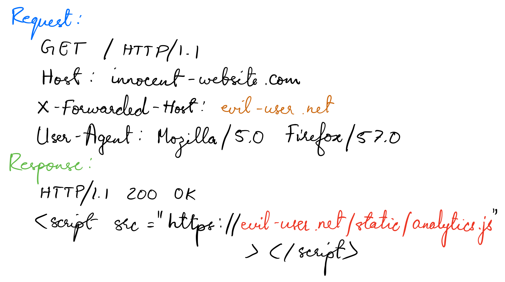

# Web cache poisoning
> Web cache poisoning is an advanced technique whereby an attacker exploits the behavior of a web server and cache so that a harmful HTTP response is served to other users.

## How does a web cache work?


### Cache keys
* Caches identify equivalent requests by comparing a predefined subset of the request's components, known collectively as the "cache key".

## What is the impact of a web cache poisoning attack?
* The impact of web cache poisoning is heavily dependent on two key factors:
    - What exactly the attacker can successfully get cached
    - The amount of traffic on the affected page

## Constructing a web cache poisoning attack
1. Identify and evaluate unkeyed inputs
2. Elicit a harmful response from the back-end server
3. Get the response cached

## Exploiting web cache poisoning vulnerabilities
### Cache design flaws
1. Using web cache poisoning to deliver an XSS attack 
    - The simplest web cache poisoning vulnerability to exploit is when unkeyed input is reflected in a cacheable response without proper sanitization.
    - Normal request and response:  
    
    Poisoned request and response:  
    
2. Using web cache poisoning to exploit unsafe handling of resource imports
    - Some websites use unkeyed headers to dynamically generate URLs for importing resources, such as externally hosted JavaScript files.
    - Malicious URL is cached, the attacker's JavaScript file is imported and executed:  
    
3. Using web cache poisoning to exploit cookie-handling vulnerabilities
    - Cookies are often used to dynamically generate content in a response.
    - Example where cookie is used to indicate the user's preferred language:  
    
    - This vector is relatively rare in comparison to header-based cache poisoning since they tend to be identified and resolved quickly because legitimate users have accidentally poisoned the cache.   
4. Using multiple headers to exploit web cache poisoning vulnerabilities
    - For example, too enforce HTTPS, if a request that uses another protocol is received, the website dynamically generates a redirect to itself that does use HTTPS.
5. Exploiting responses that expose too much information
    - Cache-control directives
        - Sometimes responses explicitly reveal some of the information an attacker needs to successfully poison the cache.
    - Vary header
        - The Vary header specifies a list of additional headers that should be treated as part of the cache key even if they are normally unkeyed.
6. Using web cache poisoning to exploit DOM-based vulnerabilities
7. Chaining web cache poisoning vulnerabilities

### Cache implementation flaws
1. Cache key flaws
    - In practice, many websites and CDNs perform various transformations on keyed components when they are saved in the cache key.
    - These transformations may introduce a few unexpected quirks due to discrepancies between the data that is written to the cache key and the data that is passed into the application code.  
    - These cache key flaws can be exploited to poison the cache via inputs that may initially appear unusable. 

2. Cache probing methodology  
    The high-level methodology for probing the cache to understand its behavior and identify any potential flaws involves:  
    1. Identify a suitable cache oracle
        * A cache oracle is simply a page or endpoint that provides feedback about the cache's behavior. This needs to be cacheable and must indicate in some way whether you received a cached response or a response directly from the server.
        * Some examples are: An HTTP header that explicitly tells you whether you got a cache hit, Observable changes to dynamic content, Distinct response times, etc.
    2. Probe key handling
        * The next step is to investigate whether the cache performs any additional processing of your input when generating the cache key. (i.e. look for transformation)
        * Example:  
        
    3. Identify an exploitable gadget
        * The final step is to identify a suitable gadget that you can chain with cache key flaws.
        * These gadgets will often be classic client-side vulnerabilities, such as reflected XSS and open redirects.

3. Exploiting cache key flaws
    1. Unkeyed port
        - The Host header is often part of the cache key and, as such, initially seems an unlikely candidate for injecting any kind of payload. However, some caching systems will parse the header and exclude the port from the cache key. 
        - This might enable you to construct a denial-of-service attack by simply adding an arbitrary port to the request.
        - This kind of attack can be escalated further if the website allows you to specify a non-numeric port.

    2. Unkeyed query string
        1. Detecting an unkeyed query string
            *  To identify a dynamic page, you would normally observe how changing a parameter value has an effect on the response.
            * But if the query string is unkeyed, most of the time you would get a cache hit, and therefore an unchanged response, regardless of any parameters you add. Clearly, this also makes classic cache-buster query parameters redundant.
            * Fortunately, there are alternative ways of adding a cache buster, such as adding it to a keyed header that doesn't interfere with the application's behavior. Examples:  
            
            * Another approach is to see whether there are any discrepancies between how the cache and the back-end normalize the path of the request.
            * As the path is almost guaranteed to be keyed, you can sometimes exploit this to issue requests with different keys that still hit the same endpoint.
            * For example, the following entries might all be cached separately but treated as equivalent to GET / on the back-end:  
            
            * This transformation can sometimes mask what would otherwise be glaringly obvious reflected XSS vulnerabilities.
        2. Exploiting an unkeyed query string
            * Poisoning the cache via an unkeyed query string would cause the payload to be served to users who visit what would otherwise be a perfectly normal URL.
            * This has the potential to impact a far greater number of victims with no further interaction from the attacker.

    3. Unkeyed query parameters
        * Some websites only exclude specific query parameters that are not relevant to the back-end application, such as parameters for analytics or serving targeted advertisements. (think UTM parameters)
        * Parameters that have been excluded from the cache key are unlikely to have a significant impact on the response.
        * But some pages handle the entire URL in a vulnerable manner, making it possible to exploit arbitrary parameters.

    4. Cache parameter cloaking
        * Any parsing discrepancies between the cache and the application can potentially allow you to sneak arbitrary parameters into the application logic by "cloaking" them in an excluded parameter.
        * For example, the de facto standard is that a parameter will either be preceded by a question mark (?), if it's the first one in the query string, or an ampersand (&). Some poorly written parsing algorithms will treat any ? as the start of a new parameter, regardless of whether it's the first one or not. 
        * Let's assume that the algorithm for excluding parameters from the cache key behaves in this way, but the server's algorithm only accepts the first ? as a delimiter. Consider the following request:  
        `GET /?example=123?excluded_param=bad-stuff-here`
        * In this case, the cache would identify two parameters and exclude the second one from the cache key.
        * However, the server doesn't accept the second ? as a delimiter and instead only sees one parameter, example, whose value is the entire rest of the query string, including our payload. 
        * If the value of example is passed into a useful gadget, we have successfully injected our payload without affecting the cache key.
        1. Exploiting parameter parsing quirks
            - Similar parameter cloaking issues can arise in the opposite scenario, where the back-end identifies distinct parameters that the cache does not.
            -  The Ruby on Rails framework, for example, interprets both ampersands (&) and semicolons (;) as delimiters.
            - Consider the following request:  
            ` GET /?keyed_param=abc&excluded_param=123;keyed_param=bad-stuff-here`  
            - Many caches will only interpret this as two parameters, delimited by the ampersand:  
                1. `keyed_param=abc` 
                2. `excluded_param=123;keyed_param=bad-stuff-here`
            - Once the parsing algorithm removes the `excluded_param`, the cache key will only contain `keyed_param=abc`. 
            - On the back-end, however, Ruby on Rails sees the semicolon and splits the query string into three separate parameters:
                1. `keyed_param=abc` 
                2. `excluded_param=123`
                3. `keyed_param=bad-stuff-here`
            - But now there is a duplicate keyed_param and if there are duplicate parameters, each with different values, Ruby on Rails gives precedence to the final occurrence.
            -  The end result is that the cache key contains an innocent, expected parameter value, allowing the cached response to be served as normal to other users.
            - On the back-end, however, the same parameter has a completely different value, which is our injected payload. It is this second value that will be passed into the gadget and reflected in the poisoned response. 
            - This exploit can be especially powerful if it gives you control over a function that will be executed. For example, if a website is using JSONP to make a cross-domain request, this will often contain a callback parameter to execute a given function on the returned data:  
                `GET /jsonp?callback=innocentFunction`
            - In this case, you could use these techniques to override the expected callback function and execute arbitrary JavaScript instead.
        2. Exploiting fat GET support
            - In select cases, the HTTP method may not be keyed.
            - This might allow you to poison the cache with a POST request containing a malicious payload in the body.
            - Your payload would then even be served in response to users' GET requests
            - Sometimes similar effect can be achieved by simply adding a body to a GET request to create a "fat" GET request:  
                ```
                GET /?param=innocent HTTP/1.1  
                ... 
                param=bad-stuff-here
                ```
            - In this case, the cache key would be based on the request line, but the server-side value of the parameter would be taken from the body. 
            - This is only possible if a website accepts GET requests that have a body, but there are potential workarounds. 
            - You can sometimes encourage "fat GET" handling by overriding the HTTP method, for example:
                ```
                GET /?param=innocent HTTP/1.1
                Host: innocent-website.com
                X-HTTP-Method-Override: POST
                ...
                param=bad-stuff-here
                ```
            - As long as the X-HTTP-Method-Override header is unkeyed, you could submit a pseudo-POST request while preserving a GET cache key derived from the request line. 
        3. Exploiting dynamic content in resource imports
            - Imported resource files are typically static but some reflect input from the query string which is mostly harmless but you can inject content when combined with web cache poisoning.
            - For example, consider a page that reflects the current query string in an import statement:  
                ```
                GET /style.css?excluded_param=123);@import... HTTP/1.1

                HTTP/1.1 200 OK
                ...
                @import url(/site/home/index.part1.8a6715a2.css?excluded_param=123);@import...
                ``` 
            - This behavior can be exploited to inject malicious CSS to exfiltrate sensitive information.
            - If the page importing the CSS file doesn't specify a `doctype`, even static CSS can be exploited.
            - Browsers will scour the document looking for CSS and execute it. Static CSS files can be poisoned by triggering a server error that reflects the excluded query parameter:  
                ```
                GET /style.css?excluded_param=alert(1)%0A{}*{color:red;} HTTP/1.1

                HTTP/1.1 200 OK
                Content-Type: text/html
                ...
                This request was blocked due to...alert(1){}*{color:red;} 
                ```
    5. Normalized cache keys
        - Any normalization applied to the cache key can introduce exploitable behavior and also enables some exploits that would be impossible.
        - For example, reflected XSS in a parameter is often unexploitable because modern browsers URL-encode when sending a request and the server doesn't decode them. The response would be be a harmless URL-encoded string.
        - If the keyed input is normalized when adding it to the cache key. The following requests would have the same key:
            ```
            GET /example?param="><test>
            GET /example?param=%22%3e%3ctest%3e 
            ```
        - Now the cache can be posioned with an unencoded XSS payload by sending a malicious request. 
        - When the victim visits the malicious URL, the payload will still be URL-encoded by their browser; however, once the URL is normalized by the cache, it will have the same cache key as the response containing the unencoded payload.
        - As a result, the cache will serve the poisoned response and the payload will be executed client-side. (make sure cache is poisoned when the victim visits the URL)
    6. Cache key injection
        - Unexploitable client-side vulnerabilities can be exploited using cache poisoning.
        - Keyed components are often bundled together in a string to create the cache key. 
        - If the cache doesn't implement proper escaping of the delimiters between the components, you can exploit this behavior to craft two different requests that have the same cache key. 
        - The following example uses double-underscores to delimit different components in the cache key and does not escape them.  
            ```
            GET /path?param=123 HTTP/1.1
            Origin: '-alert(1)-'__

            HTTP/1.1 200 OK
            X-Cache-Key: /path?param=123__Origin='-alert(1)-'__

            <script>...'-alert(1)-'...</script> 
            ```
        - Then if you induce the user to visit the following URL, the poisoned response is served:
            ```
            GET /path?param=123__Origin='-alert(1)-'__ HTTP/1.1

            HTTP/1.1 200 OK
            X-Cache-Key: /path?param=123__Origin='-alert(1)-'__
            X-Cache: hit

            <script>...'-alert(1)-'...</script> 
            ```
    7. Poisoning internal caches
        - Some websites implement caching behavior directly into the application in addition to using a distinct, external component which can avoid parsing discrepancies.
        - Since these integrated caches are purpose-built, they can be highly tailored by developers due to which they can behave in unusual ways.
        - Instead of caching entire responses, some of these caches break the response down into reusable fragments and cache them each separately. Users might receive a mixture of content from server and fragments from cache.
        - Since cached fragments are reusable, the concept of cache key doesn't apply. Every response resuses the same cached fragments.
        - Hence poisoning these fragments could have a much wide-reaching effects.
        - This often requires basic cache poisoning techniques like manipulating the `Host` header.
        1. How to identify internal caches
            - Integrated, application-level caches are difficult to identify and investigate because there is often no user-facing feedback.
            - To identify these caches, look for few tell-tale signs like response reflecting a mixture of inputs from the last request and previous request or if input is reflected on multiple distinct pages.
            - Or that the cache's behavior is wildly unusual.
        2. Testing internal caches safely
            - Using cache busters like in traditional caches shouldn't be used since it could accidentally poison the cache for genuine users.
            - Do your best to mitigate the potential damage when testing these kinds of vulnerabilities. Poison the cache using a domain you control. 

## How to prevent web cache poisoning vulnerabilities
* The definitive way to prevent web cache poisoning would clearly be to disable caching altogether.
* If you do need to use caching, restricting it to purely static responses is also effective, provided you are sufficiently wary about what you class as "static".
* If you are considering excluding something from the cache key for performance reasons, rewrite the request instead.
* Don't accept fat GET requests. Be aware that some third-party technologies may permit this by default.
* Patch client-side vulnerabilities even if they seem unexploitable.